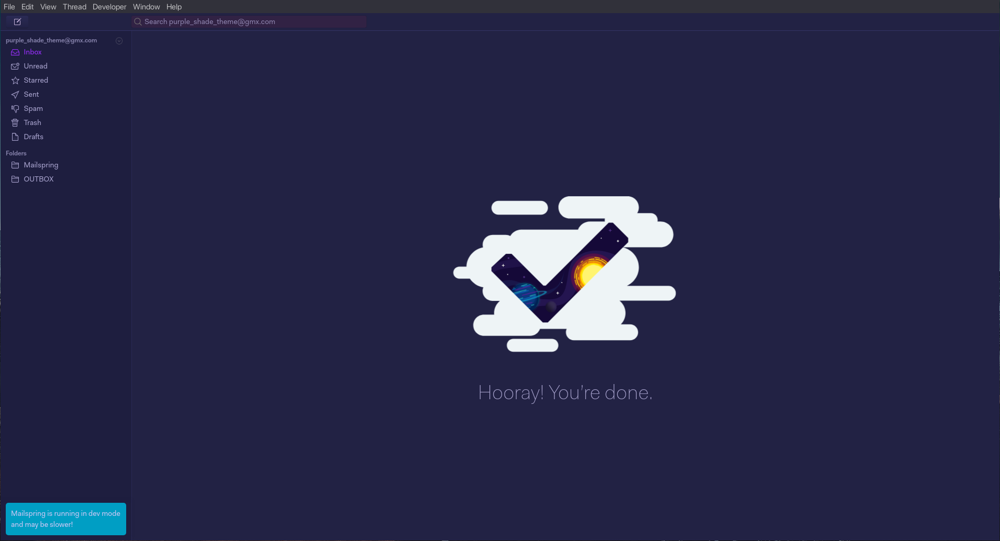
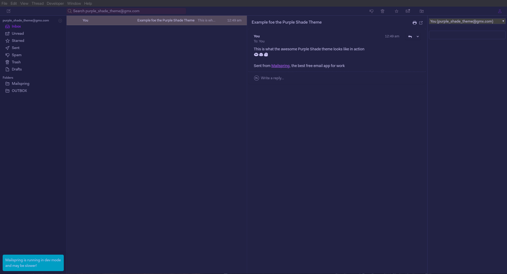

# Mailspring Purple Shade Theme

> A dark purple theme for [Mailspring](https://github.com/Foundry376/Mailspring).





## Getting Started

#### Install using Git 
If you are a git user, you can install the theme and keep up to date by cloning the repo:
   ```sh
   git clone https://github.com/ArcticStag/Mailspring-Purple-Shade-Theme.git
   ```

#### Install manually
Download using the [Github .zip download](https://github.com/Chroxify/Sweet-Mailspring/archive/refs/heads/main.zip) option and unzip them. 

### Activate the Theme
1. Open Mailspring
2. On menu Mailspring > Install New Theme... and selecting the directory
3. Close and reopen Mailspring
4. Boom! It's working

## Created By

This theme is maintained and created by
[ArcticStag](https://github.com/arcticstag) |

## License

[MIT License](./LICENSE)
